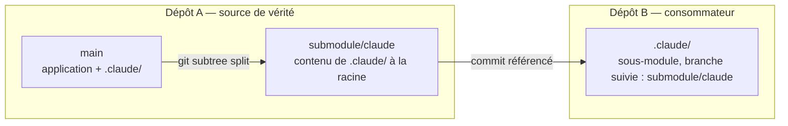
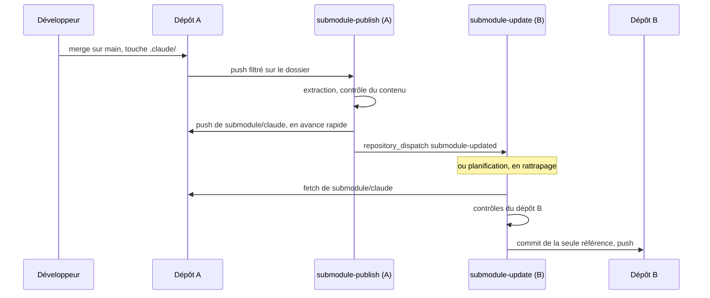

# Partager un dépôt ou un dossier par sous-module, et le tenir à jour

Deux skills du registre, à utiliser depuis n'importe quel projet :

| Skill | Où on le lance | Ce qu'il fait |
|-------|----------------|---------------|
| [`publish-git-submodule`](../skills/development/publish-git-submodule/README.md) | dans le dépôt **source** | prépare un dépôt entier ou un dossier pour être consommé comme sous-module, et le republie après chaque push |
| [`install-git-submodule`](../skills/development/install-git-submodule/README.md) | dans le dépôt **destinataire** | installe le sous-module, migre un dossier existant sans perte, et installe sa mise à jour automatique |

Le premier ne suppose aucun consommateur ; le second ne demande aucun droit d'écriture sur la
source. Une fois configurés, tout tourne en scripts Python et en GitHub Actions : aucun appel à
Claude, aucun crédit consommé.

Ce document donne la vue d'ensemble. Le détail opérationnel vit dans les `resources/references/` de
chaque skill, pour rester disponible une fois le skill installé hors du registre.

---

## Installation globale

```bash
python tools/install_skill.py install publish-git-submodule install-git-submodule
```

Les skills sont copiés dans `~/.claude/skills/` (sous Windows : `%USERPROFILE%\.claude\skills\`). Le
dépôt reste la source de vérité ; après une modification ici, relancer la même commande.

```bash
python tools/install_skill.py check publish-git-submodule install-git-submodule
```

```bash
python tools/install_skill.py uninstall publish-git-submodule install-git-submodule
```

Détails : [install.md](install.md#skills).

---

## Architecture à deux dépôts

Un sous-module référence **un commit** d'un dépôt. Pour partager un seul dossier sans créer un
troisième dépôt, son contenu est publié à la racine d'une branche d'export du dépôt source.



Pour un dépôt entier, il n'y a pas de branche d'export : le consommateur suit `main`.

Limiter ce qui est extrait ne limite ni les objets Git téléchargeables ni les droits : la branche
d'export vit dans le dépôt A, et qui la lit peut lire tout le dépôt A.

---

## Trois exemples

### Un dépôt entier

```text
dépôt source        /publish-git-submodule source=. branch=main auto=true
dépôt destinataire  /install-git-submodule url=https://github.com/acme/outil.git branch=main target=vendor/outil auto=true
```

### Le dossier `.claude`

```text
dépôt source        /publish-git-submodule source=.claude branch=main export=submodule/claude auto=true
dépôt destinataire  /install-git-submodule url=https://github.com/acme/toolkit.git branch=submodule/claude target=.claude auto=true
```

### Le dossier `docs`

```text
dépôt source        /publish-git-submodule source=docs branch=main export=submodule/docs auto=true
dépôt destinataire  /install-git-submodule url=https://github.com/acme/toolkit.git branch=submodule/docs target=docs/shared auto=true
```

Un même dépôt peut publier plusieurs dossiers et consommer plusieurs sous-modules. La branche
principale n'est jamais supposée s'appeler `main` : elle est détectée, et `branch=` la fixe.

---

## Flux automatique après un merge



Un push fait avec `GITHUB_TOKEN` ne déclenche aucun autre workflow : c'est pourquoi le producteur
publie **et** notifie dans la même exécution.

---

## Événement et planification

| Mode | Ce qu'il faut | Délai |
|------|---------------|-------|
| Planifié | lecture du dépôt source | l'intervalle du cron, plus les retards de GitHub |
| Événementiel | inscription du consommateur chez le producteur, et un secret côté producteur | quelques secondes |
| Manuel | — | immédiat |

Le consommateur s'inscrit en demandant au dépôt source :

```text
/publish-git-submodule register name=claude consumer=acme/application
```

Les deux modes se cumulent : l'événement pour la réactivité, la planification pour rattraper un
événement perdu. Déclarer une branche dans `.gitmodules` ne déclenche rien à soi seul.

---

## Permissions et secrets

Aucun secret dans Git, dans `.gitmodules` ni dans une URL : uniquement des secrets GitHub Actions.

| Secret | Dépôt | Quand | Permission minimale |
|--------|-------|-------|---------------------|
| `SUBMODULE_DISPATCH_TOKEN` | producteur | mode événementiel | « Contents: read and write » sur les seuls dépôts consommateurs |
| `SUBMODULE_FETCH_TOKEN` | consommateur | dépôt source privé | « Contents: read » sur le dépôt source |
| `SUBMODULE_PUSH_TOKEN` | consommateur | branche protégée, ou CI à déclencher sur le commit de mise à jour | « Contents » (et « Pull requests » en mode `pr`) en écriture sur ce dépôt |

Avec deux dépôts publics et une branche destinataire non protégée, le mode planifié fonctionne sans
aucun secret. Jeton à permissions fines ou GitHub App ; cette dernière est préférable.

Si la branche destinataire interdit le push direct, rien n'est contourné : `mode=pr` ouvre une
pull request à fusion automatique, soumise aux contrôles obligatoires. Une revue humaine obligatoire
rend la mise à jour non automatique — c'est le choix du dépôt.

Détails : [automation.md du producteur](../skills/development/publish-git-submodule/resources/references/automation.md),
[permissions.md du consommateur](../skills/development/install-git-submodule/resources/references/permissions.md).

---

## Migrer un dossier existant

Le dossier cible n'est jamais supprimé ni écrasé directement. Il est comparé à la source ; s'il en
diffère, l'installation s'arrête sans rien modifier, liste chaque fichier et attend une décision.
`migrate=preserve` sauvegarde tout dans `.git/submodule-sync-backups/`, installe la source, et
replace les fichiers propres au projet, non suivis. Rien n'est envoyé vers la source partagée.

Détails : [migration.md](../skills/development/install-git-submodule/resources/references/migration.md).

---

## Diagnostic, retour arrière, désactivation

| Besoin | Commande |
|--------|----------|
| L'export est-il à jour ? (source) | `python3 .github/submodule-sync/publish.py status` |
| La référence est-elle à jour ? (consommateur) | `python3 .github/submodule-sync/update.py status` |
| D'où vient le commit installé ? | `git log -1 --format=%B -- <chemin>` : `Submodule-Old`, `Submodule-New`, `Source-Commit` |
| Revenir à un ancien commit | `"hold": true` sur le sous-module, puis déplacer la référence à la main |
| Tout désactiver | supprimer le workflow ; rien d'autre ne casse |

Détails : [côté source](../skills/development/publish-git-submodule/resources/references/troubleshooting.md),
[côté consommateur](../skills/development/install-git-submodule/resources/references/troubleshooting.md).

---

## Limites

- **Historique.** Une extraction subtree publie l'historique du dossier : un fichier retiré y reste.
  Le contenu et son historique sont contrôlés avant publication ; `strategy=snapshot` publie sans
  historique et accepte des exclusions.
- **Permissions.** Extraire un dossier n'isole pas les droits d'accès au dépôt source. Notifier un
  autre dépôt exige un jeton en écriture sur ce dépôt.
- **Synchronisation locale.** Les workflows mettent à jour les dépôts distants, pas les clones :
  `git submodule update --init` sur chaque poste, ou `git config submodule.recurse true`. Aucune
  tâche planifiée locale n'est créée.
- **Sens unique.** Le producteur est la source de vérité ; une modification faite dans le
  sous-module d'un consommateur ne remonte jamais.
- **Ce qui est prouvé.** Quarante-deux tests locaux sur dépôts temporaires prouvent la logique git. Ils
  ne prouvent ni les permissions ni l'exécution réelle sur GitHub Actions : installer un workflow
  n'est pas l'avoir vu tourner.
