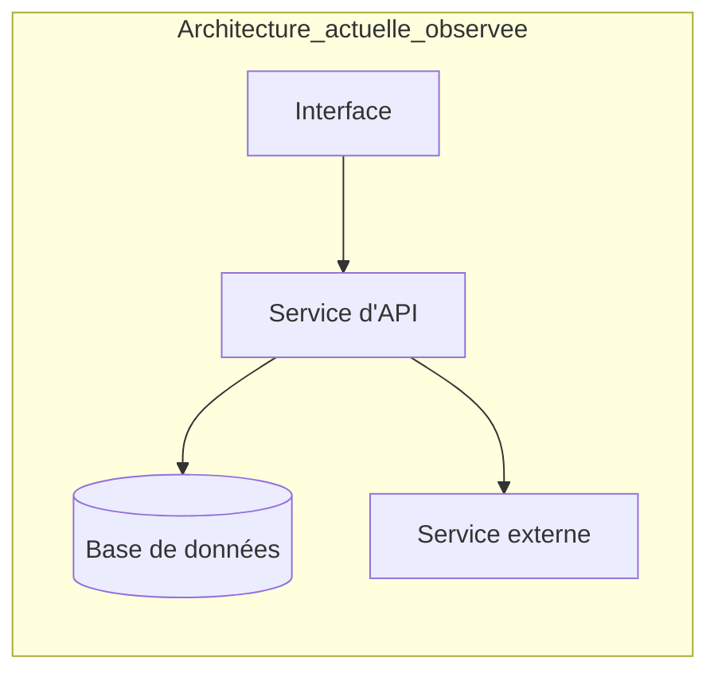
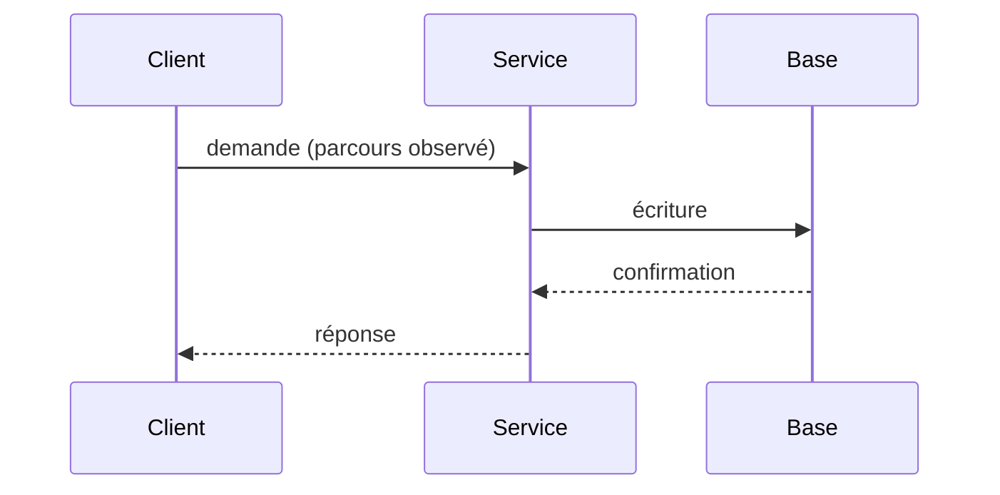

# Axes d'investigation

Des **pistes**, pas une liste de défauts à déclarer. Choisir les axes que le projet et la demande justifient ; en laisser d'autres de côté est normal (le noter dans la couverture). Chaque piste indique quoi regarder, et la précaution avant de conclure.

| Axe | Regarder | Avant de conclure |
|-----|----------|-------------------|
| Responsabilités et frontières | ce que chaque module possède ; ce qu'il expose ; ce qu'il importe | une dépendance « interdite » l'est-elle selon une règle écrite (ADR, config d'architecture) ou selon le goût de l'analyste ? |
| Points d'entrée et parcours | `main`, serveurs, routes, commandes, tâches planifiées, écouteurs de messages, exports de bibliothèque, éléments d'interface | suivre le parcours jusqu'à l'effet (donnée écrite, message envoyé, écran) |
| Contrats entre composants | signatures, schémas, formats de messages, erreurs promises, versions | comparer à l'appelant *réel*, pas à l'appelant imaginé |
| Dépendances et cycles | manifestes, graphe d'imports, versions épinglées ou flottantes | un cycle au niveau des paquets n'est pas forcément un cycle de runtime |
| Données | modèles, schémas, migrations, cycle de vie (création, mise à jour, suppression, archivage), contraintes, index | distinguer la contrainte portée par la base de celle portée par le code |
| Erreurs, transactions, reprise | gestion d'exceptions, rollback, idempotence, relances, files de rebut | vérifier le comportement sur l'échec partiel, pas seulement sur l'échec total |
| Concurrence et ressources | verrous, partage d'état, tâches asynchrones, pools, fermeture de ressources, délais d'attente | un problème de concurrence se démontre par un scénario d'entrelacement ou un test, rarement par la lecture seule |
| Configuration et intégrations | variables d'environnement, fichiers de config, clients externes, délais, nouvelles tentatives, valeurs par défaut | ne jamais copier de secret dans un constat ; citer le nom de la variable |
| Sécurité | entrées non fiables, authentification et autorisation, secrets, injection, désérialisation, journaux, dépendances vulnérables | vérifier les protections amont (framework, passerelle) avant de déclarer une absence ; marquer *risque potentiel* tant que l'exploitation n'est pas démontrée |
| Performances | boucles de requêtes, chargements en masse, allocations, E/S bloquantes sur le parcours principal | mesurer ou tracer la fréquence réelle ; sans mesure : risque potentiel |
| Tests et lacunes | ce que les tests couvrent, ce qu'ils vérifient *vraiment*, tests désactivés, données de test irréalistes | une absence de test est un fait ; un manque de couverture ne devient une lacune qu'au regard d'un comportement qui compte |
| Documentation et specs | README, docs d'architecture, ADR, specs OpenSpec, commentaires | chaque divergence est un constat de contradiction (voir `evidence-model.md`) |

## Signaux de priorisation (aides, pas verdicts)

Activité Git récente et concentrée (`git log --since=<période> --name-only`), fichiers très volumineux, marqueurs `TODO`/`FIXME`/`HACK`, tests ignorés ou instables, modules sans test, parcours exposés à l'extérieur, code qui touche aux données ou à l'argent. Un signal oriente la lecture ; il ne prouve rien.

## Diagrammes

Utiliser Mermaid dans les fichiers Markdown, seulement quand la relation est difficile à lire en texte. Chaque diagramme porte un titre et son statut : **« Architecture actuelle (observée) »** ou **« Architecture proposée »** — jamais mélangés dans le même schéma. Une architecture proposée renvoie aux constats qui la justifient ; sans constat, pas de proposition.

### Niveau de détail (C4, quand la portée le justifie)

| Niveau | Quand | Contenu |
|--------|-------|---------|
| Contexte | audit global, ou système avec plusieurs acteurs et systèmes externes | le système, ses utilisateurs, ses dépendances externes |
| Conteneurs | applications ou services déployables distincts | processus, magasins de données, protocoles |
| Composants | un conteneur ou un module précis | composants et leurs relations |
| Code | rarement | seulement pour un point précis d'un constat |

### Structure inspirée d'arc42 (audit global)

Reprendre seulement les sections utiles, avec les titres du projet si une convention existe : contexte et périmètre ; contraintes ; vue de bloc de construction ; vue d'exécution (parcours critiques) ; vue de déploiement (si observable) ; concepts transverses (sécurité, erreurs, persistance) ; décisions d'architecture (renvoi aux ADR existants) ; risques et dette ; glossaire. Une analyse ciblée n'en a pas besoin : un paragraphe de contexte et un schéma suffisent.

### Exemples minimaux

