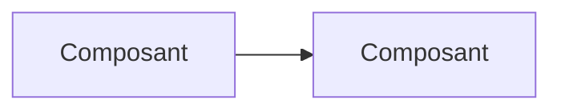

# Cartographie de l'existant

> Description de **l'existant observé**. Ce n'est pas la spécification du comportement souhaité.

## Contexte et périmètre

## Modules et responsabilités

| Module | Responsabilité observée | Dépend de | Points d'entrée | Preuve |
|--------|-------------------------|-----------|-----------------|--------|

## Parcours fonctionnels

Pour chaque parcours : déclencheur → traitement → effets (`chemin:ligne`).

## Données

Modèles, cycle de vie, migrations, contraintes (portées par la base ou par le code).

## Intégrations et configuration

Systèmes externes, variables d'environnement (noms seulement), délais, relances.

## Diagrammes

### Architecture actuelle (observée)

### Architecture proposée (seulement si des constats la justifient)

Renvoyer aux constats `F-NNN`. Sans constat, supprimer cette section.

## Contradictions entre sources

Renvoi aux constats concernés.
