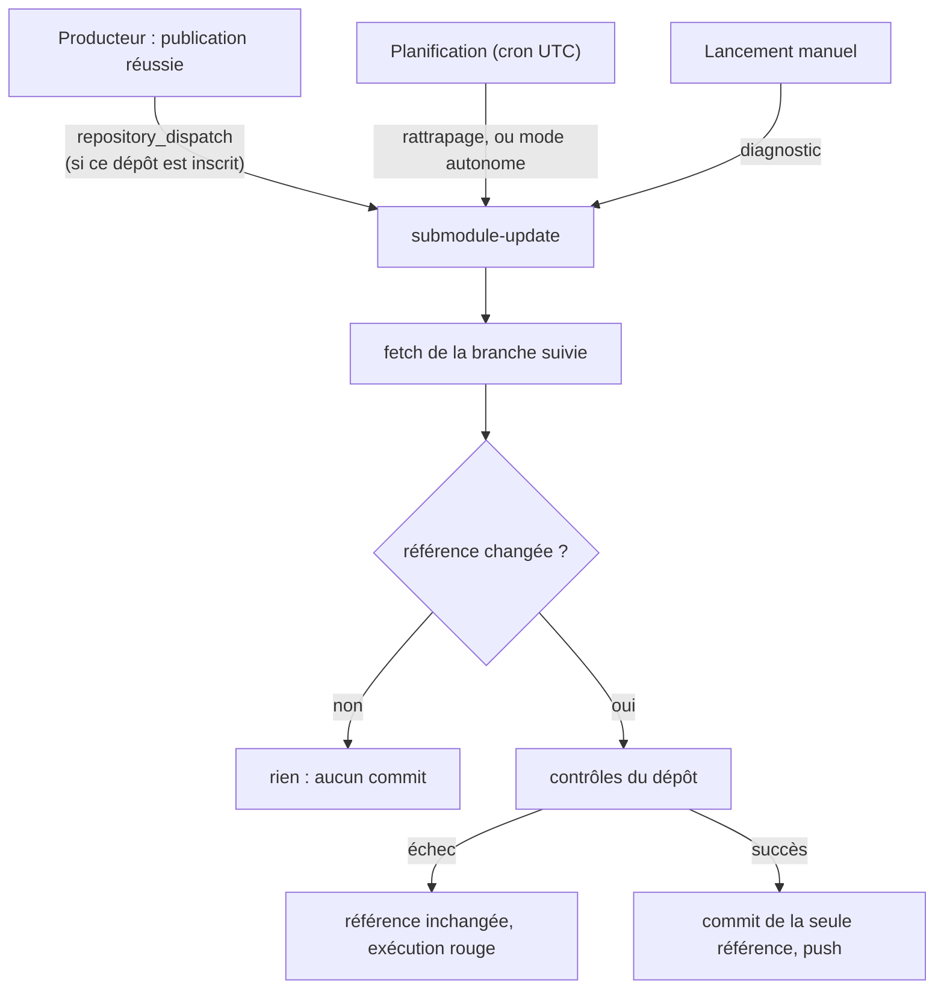

# Mise à jour automatique : déclenchement et garde-fous

Déclarer une branche dans `.gitmodules` ne met rien à jour : ce n'est qu'une indication pour
`git submodule update --remote`. La mise à jour est l'affaire du workflow
`.github/workflows/submodule-update.yml`, qui lance `.github/submodule-sync/update.py`.

## Trois déclencheurs



| Déclencheur | Dépend de | Délai |
|-------------|-----------|-------|
| Événement | inscription chez le producteur et secret `SUBMODULE_DISPATCH_TOKEN` côté producteur | quelques secondes |
| Planification | rien d'autre que la lecture du dépôt source | jusqu'à l'intervalle choisi, plus les retards de GitHub |
| Manuel | — | immédiat |

Le mode planifié suffit à lui seul et ne demande aucun droit sur le dépôt source au-delà de la
lecture. L'événement ajoute la réactivité ; garder la planification en rattrapage couvre un
événement perdu ou un jeton expiré. `schedule=none` la retire.

S'inscrire pour l'événement, dans le dépôt source :

```text
/publish-git-submodule register name=<publication> consumer=<propriétaire>/<ce-dépôt>
```

## Ce que fait une exécution

1. Lit `.gitmodules` (URL, branche suivie) et `.github/submodule-update.json` (sous-modules gérés).
2. Sur événement, valide la charge utile champ par champ et ne retient que les sous-modules dont la
   source et la branche correspondent. Un événement étranger est ignoré avec un avertissement ; un
   événement mal formé arrête tout.
3. Récupère la tête de la branche suivie. **C'est elle qui est adoptée, jamais le SHA annoncé.**
4. Si la référence n'a pas changé : rien.
5. Sinon, extrait le nouveau commit, lance les contrôles, crée un commit qui ne contient que la
   référence, avec les SHA en pied de message (`Submodule-Old`, `Submodule-New`, `Source-Commit`).
6. Pousse sur la branche destinataire, sans jamais forcer.

## Garde-fous

| Risque | Parade |
|--------|--------|
| Événement en double | la référence est déjà à jour : aucun commit |
| Événement ancien arrivé en retard | la tête de branche fait foi ; un commit qui n'est pas un descendant de la référence actuelle est refusé |
| Branche source réécrite | refus (code 4) tant que `allow_non_fast_forward` n'est pas posé |
| Exécutions concurrentes | groupe de concurrence unique, sans annulation ; chacune repart de l'état distant |
| Push rejeté parce que la branche a avancé | rebase du commit de référence, puis nouvel essai ; conflit sur la même référence : arrêt, rien n'est forcé |
| Boucle de synchronisation | aucun commit sans changement de SHA ; le workflow n'écoute pas les `push` ; rien ne remonte vers la source |
| Injection par un paramètre ou une charge utile | git est lancé sans shell ; les valeurs de l'événement passent par l'environnement, validées par expression régulière ; chemins et branches sont vérifiés |
| Contrôle qui exécute du contenu importé | contrôles lancés sans jeton dans l'environnement, extraction sans identifiant persistant |
| Travail local dans le sous-module | fichier suivi modifié ou commit local : la mise à jour s'arrête sans rien toucher |

Le producteur reste la source de vérité, sans synchronisation en retour : une modification faite
dans le sous-module d'un consommateur n'atteint jamais la source par ce mécanisme.

## Contrôles

```text
/install-git-submodule url=… branch=… target=.claude check="python tools/validate.py"
```

Les contrôles sont des commandes du dépôt consommateur, inscrites dans sa configuration (`checks`,
global ou par sous-module). Ils voient `SUBMODULE_PATH`, `SUBMODULE_OLD_SHA` et `SUBMODULE_NEW_SHA`.
Le premier qui échoue annule la mise à jour : la référence revient à son ancienne valeur, rien n'est
commité, l'exécution est rouge. Aucune commande n'est jamais tirée du contenu importé.

Ils s'exécutent par le shell du système : `sh` sur un runner Linux, `cmd` sur un poste Windows.
Écrire des commandes qui passent dans les deux si la mise à jour est aussi lancée à la main.

## Dépôt distant et postes de travail

Le workflow met à jour le **dépôt distant**. Il ne touche à aucun clone.

Sur un poste, après un `git pull` qui a déplacé une référence :

```bash
git submodule update --init --recursive
```

Pour que `git pull`, `git checkout` et `git switch` le fassent d'eux-mêmes dans ce clone :

```bash
git config submodule.recurse true
```

Aucune tâche planifiée locale n'est créée par le skill. Pour en ajouter une, planifier (Planificateur
de tâches Windows, cron) la commande suivante dans le clone ; elle n'avance qu'en avance rapide et
ne touche pas à un travail en cours :

```bash
git pull --ff-only --recurse-submodules
```

Lancer la mise à jour à la main, sans pousser, pour voir ce que ferait le workflow :

```bash
python3 .github/submodule-sync/update.py run
```
