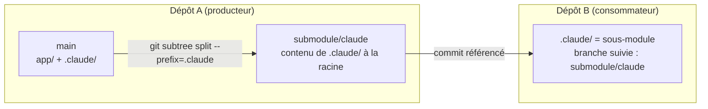
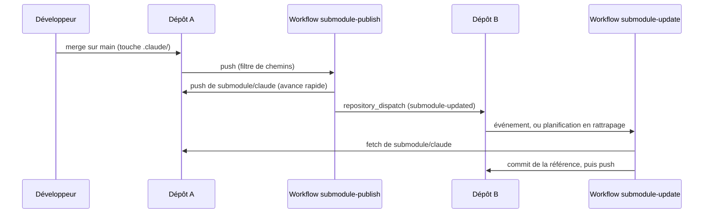

# Architecture : deux modes, deux dépôts

Un sous-module ne référence ni une branche ni un dossier : il référence **un commit** d'un dépôt
Git. Tout le reste en découle.

## Dépôt entier (`source=.`)

Le dépôt est déjà consommable tel quel. Rien n'est extrait, aucune branche d'export n'est créée :
les consommateurs suivent la branche source. Le skill vérifie la branche et le remote, enregistre la
publication, et installe le workflow qui notifie les consommateurs à chaque push.

## Dossier (`source=.claude`)



- Le dossier reste un dossier normal sur la branche source : on y travaille comme avant.
- Son contenu est publié **à la racine** de la branche d'export. Installé dans `.claude/` chez le
  consommateur, il donne `.claude/CLAUDE.md`, jamais `.claude/.claude/CLAUDE.md`.
- La branche d'export appartient au **même dépôt distant**. Aucun troisième dépôt.
- La branche d'export est dérivée : on ne la modifie pas à la main.

`git subtree split` est déterministe : le même historique donne les mêmes commits. C'est ce qui
permet de relancer la publication sans rien créer quand rien n'a changé, et de pousser en avance
rapide quand le dossier a évolué.

## Ce que l'extraction ne garantit pas

Publier un dossier limite ce qui apparaît dans le dossier de travail du consommateur. Cela ne limite
**pas** :

- **les objets téléchargés** : un `git clone` ordinaire du dépôt A rapatrie toutes ses branches. Le
  sous-module, lui, ne rapatrie que ce qui est atteignable depuis la branche suivie ;
- **les droits d'accès** : la branche d'export vit dans le dépôt A. Qui peut la lire peut lire tout
  le dépôt A. Pour isoler des droits, il faut un dépôt distinct, ce que ce skill ne fait pas.

## Plusieurs publications

Un dépôt peut publier plusieurs dossiers, chacun sous son nom, sur sa branche :

```text
/publish-git-submodule source=.claude export=submodule/claude
/publish-git-submodule source=docs    export=submodule/docs
```

Elles partagent un fichier de configuration (`.github/submodule-publish.json`) et un workflow, dont
le filtre de chemins est l'union des dossiers publiés. Un push ne republie que les exports dont le
contenu a changé.

## Flux après un merge



Le producteur reste la source de vérité. Il n'existe aucune synchronisation en sens inverse.
